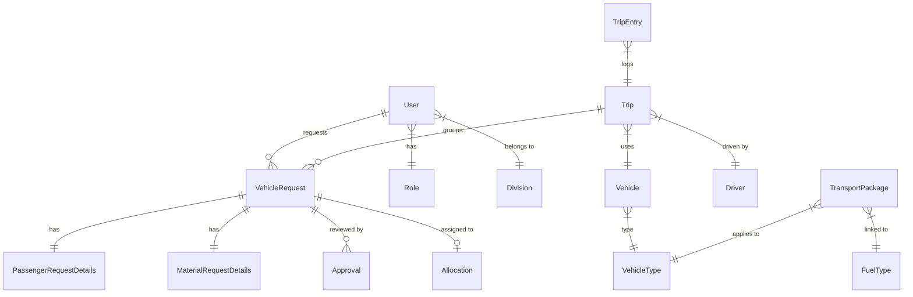

# 🗄️ TMS 2.0 Database Schema Documentation

This document provides a detailed breakdown of the MariaDB/MySQL database schema for the Transport Management System (TMS) 2.0. The system uses **Sequelize-TypeScript** as the ORM.

---

## 🗺️ Entity Relationship Overview

The schema is built around the `VehicleRequest`, which acts as the primary transaction unit. It branches into identity (Users/Roles), fleet (Vehicles/Drivers), and fulfillment (Trips/Allocations).

---

## 👥 1. Identity & Organization

### `users`
Core table for all system actors.

| Field | Type | Description |
| :--- | :--- | :--- |
| `id` | INT (PK) | Auto-incrementing primary key. |
| `employee_id` | STRING | Unique corporate ID for HRIS users. |
| `name` | STRING | Full name of the user. |
| `email` | STRING | Unique email used for login and notifications. |
| `password_hash`| STRING | Bcrypt hashed password. |
| `role_id` | INT (FK) | Links to `roles.id`. |
| `division_id` | INT (FK) | Primary department. |
| `account_type` | ENUM | `HRIS` or `LOCAL`. |

### `roles`
Defines system capabilities.

| Field | Type | Description |
| :--- | :--- | :--- |
| `id` | INT (PK) | Primary key. |
| `name` | ENUM | `ADMIN`, `STAFF`, `COORDINATOR`, `HOD`, `TRANSPORT`, `DRIVER`. |

### `divisions` / `sub_divisions`
Organizational hierarchy for approval routing.

---

## 📝 2. Request Management

### `vehicle_requests`
The central model for all transport needs.

| Field | Type | Description |
| :--- | :--- | :--- |
| `id` | INT (PK) | Primary key. |
| `requested_by` | INT (FK) | Links to `users.id`. |
| `request_type` | ENUM | `PASSENGER` or `MATERIAL`. |
| `status` | ENUM | Current stage (e.g., `PENDING_HOD`, `APPROVED`). |
| `purpose` | TEXT | Reason for travel. |
| `wbs_job_id` | STRING | Budget code for financial tracking. |
| `parent_id` | INT (FK) | Self-link for return leg requests. |

### `passenger_request_details` / `material_request_details`
Type-specific payloads for requests containing pickup/drop lat-longs, passenger counts, or cargo weights.

---

## 🚛 3. Fleet & Fulfillment

### `vehicles`
Inventory of all transport assets.

| Field | Type | Description |
| :--- | :--- | :--- |
| `id` | INT (PK) | Primary key. |
| `vehicle_number`| STRING | Unique license plate. |
| `vehicle_type_id`| INT (FK) | Links to `vehicle_types.id`. |
| `ownership` | ENUM | `COMPANY` or `VENDOR`. |
| `attributes` | JSON | Dynamic data (e.g., AC: true, Boot: 400L). |
| `documents` | JSON | Paths to images (Insurance, Revenue License). |

### `trips`
Represents a physical journey on a specific date.

| Field | Type | Description |
| :--- | :--- | :--- |
| `id` | INT (PK) | Primary key. |
| `vehicle_id` | INT (FK) | Vehicle assigned to this trip. |
| `driver_id` | INT (FK) | Driver assigned to this trip. |
| `date` | DATEONLY | Date of travel. |
| `start_time` | TIME | Planned departure time. |
| `status` | ENUM | `PLANNED`, `ON_GOING`, `COMPLETED`. |

---

## 💰 4. Finance & Pricing

### `transport_packages`
Calculation logic for journey costs.

| Field | Type | Description |
| :--- | :--- | :--- |
| `id` | INT (PK) | Primary key. |
| `package_category`| ENUM | `PER_KM`, `MONTHLY`, `DAILY`. |
| `base_amount` | DECIMAL | Fixed fee for monthly/daily. |
| `extra_km_rate` | DECIMAL | Rate charged per KM. |
| `fuel_efficiency`| DECIMAL | Odometer KM per Liter for adjustments. |

### `trip_entries`
Logged at the end of every trip for final payment.

| Field | Type | Description |
| :--- | :--- | :--- |
| `id` | INT (PK) | Primary key. |
| `total_km` | FLOAT | Distance traveled. |
| `fuel_adjustment` | DECIMAL | Calculated variance based on fuel prices. |
| `final_amount` | DECIMAL | Total cost payable. |

---

## 🔒 5. System Tables

*   **`push_subscriptions`**: Stores VAPID tokens for browsers.
*   **`notification_configs`**: Maps roles to specific status-change alerts.
*   **`system_configs`**: Global variables (e.g., 4:30 PM Cutoff enabled/disabled).

---
*Generated by TMS development team*
